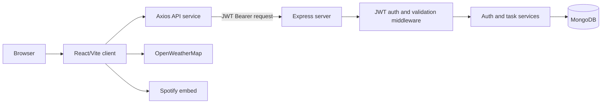
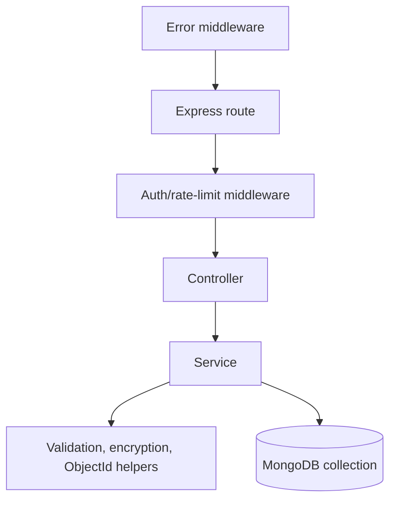
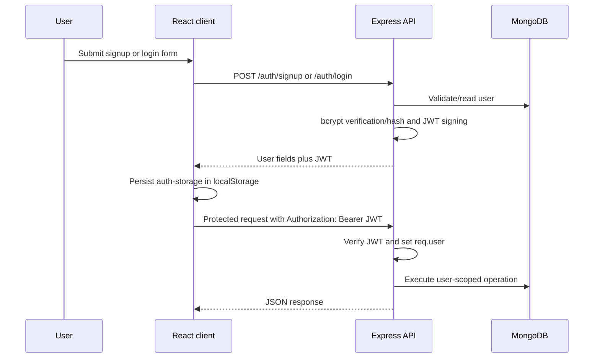

# System Architecture

## Overall architecture

The application is a browser client and a separate Express API backed by MongoDB. The client calls the API directly using the configured `VITE_API_URL` (default `http://localhost:3000`). The Vite `/api` proxy is configured but the current service calls do not use the `/api` prefix.

This is a MERN-style implementation: MongoDB, Express, React, and Node.js. The backend uses the native MongoDB driver rather than Mongoose, so there are no Mongoose schema classes or ODM middleware.

## Frontend architecture

- `client/src/main.tsx` mounts the application.
- `client/src/App.tsx` establishes routing, theme, shared layout, lazy page loading, and initial task fetch.
- Pages compose domain components such as `TaskForm`, `TaskList`, and `NotificationBell`.
- Zustand stores hold persisted auth, tasks/categories, theme, and toast state.
- Service modules isolate Axios calls.
- Hooks derive filtered tasks and deadline notifications from store state.

Route-level pages are lazy-loaded with `React.lazy` and rendered inside a `Suspense` fallback.

## Backend architecture

The backend follows a route → controller → service → database arrangement:

`server/src/index.js` creates the Express app, applies headers, CORS, JSON parsing, database context injection, routes, static uploads, 404 handling, and centralized errors. `server/src/db.js` owns the MongoDB client and indexes.

## Authentication flow

The client stores the token through Zustand persistence and attaches it through the Axios request interceptor. There is no refresh-token or server-side session store.

## Task data flow

On create/update, the service validates input and encrypts title, description, priority, and subject before writing to `AcadTasks`. On reads, those fields are decrypted before the response is returned. Deadline, completion, ownership, and timestamps remain ordinary MongoDB values.

## Important integrations

- MongoDB is the only backend data integration.
- OpenWeatherMap is called directly by `WeatherWidget` from the browser.
- Spotify is embedded by URL in `SpotifyWidget`; there is no Spotify API integration.
- Browser Geolocation and Notifications are optional client capabilities.
- Google Fonts is loaded from `client/index.html`.
