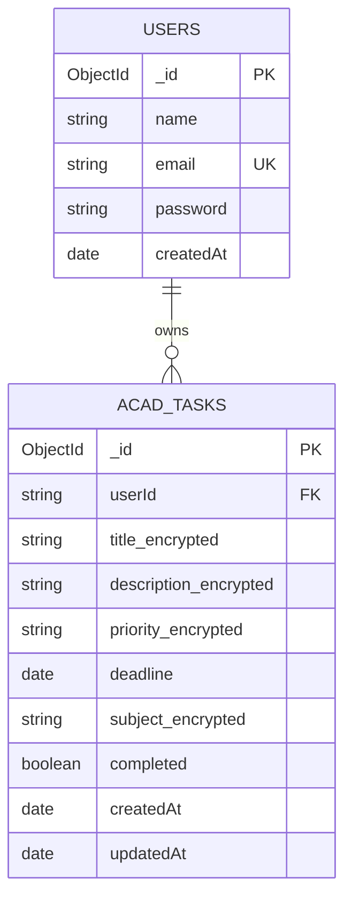

# Database Documentation

## Technology and connection

The server uses the official `mongodb` Node.js driver. `server/src/db.js` creates one `MongoClient`, connects with five-second server-selection and connection timeouts, and allows a pool of up to 20 connections. The selected database name comes from the connection URI.

The application initializes indexes when a connection succeeds. No migrations or schema versioning mechanism is present.

## Collections

### `users`

| Field | Stored type | Required in application | Rules/defaults |
|---|---|---:|---|
| `_id` | `ObjectId` | Generated by MongoDB | Returned as string by auth service |
| `name` | string | Yes | Trimmed; maximum 100 characters |
| `email` | string | Yes | Lowercase/trimmed; email regex; maximum 254 characters; unique index |
| `password` | string | Yes | bcrypt hash; input must be 8–128 characters; never returned |
| `createdAt` | `Date` | Yes | Set to current time during signup |

There is no database schema validator. Requiredness and constraints are enforced by `auth.service.js`.

### `AcadTasks`

| Field | Stored type | Required in application | Rules/defaults |
|---|---|---:|---|
| `_id` | `ObjectId` | Generated by MongoDB | Must be a 24-character hex id in route parameters |
| `userId` | string | Yes | Taken from verified JWT, not trusted from create payload |
| `title` | encrypted string | Yes | Trimmed; plaintext max 200 characters before encryption |
| `description` | encrypted string | No | Empty string when omitted; maximum 2,000 characters |
| `priority` | encrypted string | Yes | Create defaults invalid/missing input to `medium`; update rejects invalid values |
| `deadline` | `Date` | Yes | Parsed with `Date.parse`; create defaults to current date if omitted |
| `subject` | encrypted string | No | Empty string when omitted; maximum 100 characters |
| `completed` | boolean | Yes | Coerced with `Boolean`; create defaults false |
| `createdAt` | `Date` | Yes | Set during create |
| `updatedAt` | `Date` | Yes | Set during create and update |

Task title, description, priority, and subject use AES-256-GCM in current writes. The service can read legacy AES-256-CBC values and returns original text if a value is not decryptable.

## Indexes

| Collection | Index | Options/purpose |
|---|---|---|
| `users` | `{ email: 1 }` | Unique; supports duplicate prevention and lookup |
| `AcadTasks` | `{ userId: 1, createdAt: -1 }` | Supports user-scoped listing and creation-time sorting |

The task service sorts by `createdAt` descending in code. The compound index is aligned with that query.

## Relationships

There are no MongoDB foreign keys. `AcadTasks.userId` is a string representation of the user `_id`, and routes enforce ownership by comparing it to `req.user.userId`. A task’s `subject` is a client category id or arbitrary subject string; it does not reference a database collection.

The relationship is logical rather than a MongoDB-enforced reference.
