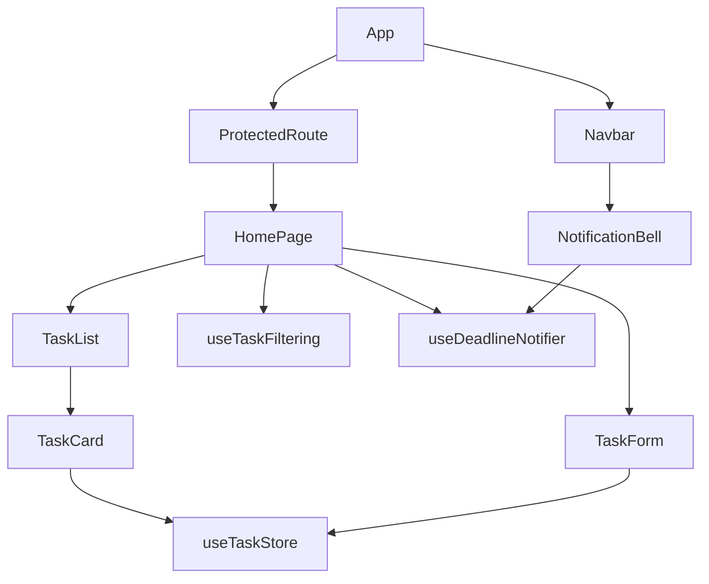

# Frontend Documentation

## Routes

| Route | Access | Component |
|---|---|---|
| `/` | Protected | `HomePage` |
| `/profile` | Protected | `ProfilePage` |
| `/login` | Public; redirects authenticated users to `/` | `LoginPage` |
| `/signup` | Public; redirects authenticated users to `/` | `SignupPage` |
| `*` | Public fallback | `NotFoundPage` |

`ProtectedRoute` preserves the attempted location in navigation state when redirecting to login. `Navbar` and `Footer` are rendered around all routes.

## State management

| Store | Persistence | Contents |
|---|---|---|
| `useAuthStore` | `auth-storage` localStorage | user, JWT, auth flag, login/signup/logout/profile update |
| `useTaskStore` | `task-storage` localStorage | tasks, categories, loading/error, CRUD actions, derived helpers |
| `useThemeStore` | `theme-storage` localStorage | light/dark theme |
| `useToast` | None | current toast messages and timers |

`App` fetches tasks after a user id becomes available. `useTaskFiltering` scopes, filters, searches, and sorts the store’s task array. `useDeadlineNotifier` derives urgent/overdue tasks and drives the banner, bell, browser notifications, and toasts.

## API communication

`services/api.ts` creates an Axios client with a ten-second timeout, JSON headers, and `VITE_API_URL`/localhost fallback. A request interceptor attaches the JWT. A response interceptor logs a warning for 401 responses but does not automatically log the user out. `authService.ts` and `taskService.ts` provide typed endpoint wrappers.

## Component relationships

## Forms and validation

`AuthForm` performs required-field, email, and signup password checks. `TaskForm` checks title, date, and subject and delegates length/date/priority enforcement to the server. `Input` supplies labels, generated ids, icons, helper text, error text, `aria-invalid`, and `aria-describedby`.

## Loading, error, and empty states

- Lazy route loading uses `PageLoadingFallback`.
- Dashboard task fetch shows a spinner.
- Empty pending/completed sections use `TaskList` messages.
- Toasts provide success, warning, info, and error feedback.
- Auth errors are shown inside the auth card.
- Weather falls back to a static display when the API fails.
- Task sync failures generally preserve or roll back local state and show a toast.

## Responsive and visual behavior

Tailwind class-based dark mode, responsive grids, glass cards, animated transitions, and Framer Motion are used throughout. The dashboard changes from a two-column task/widgets layout to a single column below the large-screen breakpoint. The stylesheet includes reduced-motion handling.

## Current frontend gaps

- A 401 response is logged but does not clear auth state or redirect.
- Categories and offline tasks are persisted per browser, not synchronized to the account.
- Browser notifications and weather require permissions/network access.
- No frontend automated tests, accessibility audit, or error boundary is present.
